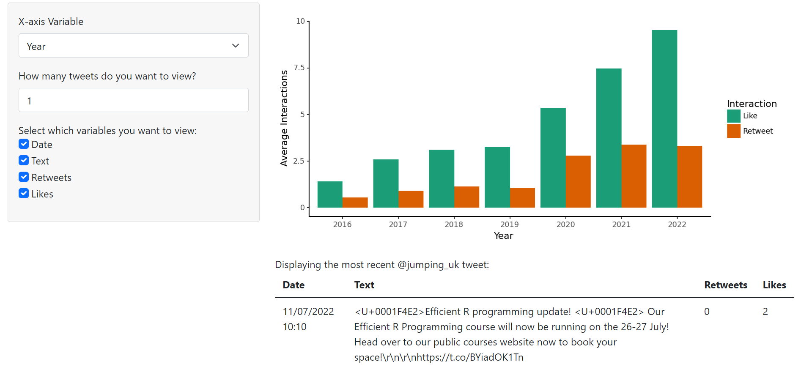

# Introduction 

As someone who has zero experience using [Shiny in R](https://shiny.rstudio.com/), the recent announcement that the framework had been made available to Python users inspired an opportunity for me to learn a new concept from a different perspective to most of my colleagues. I have been tasked with writing a Python related blog post, and having spent the past few weeks carrying out an analysis of Jumping Rivers' Twitter data ([@jumping_uk](https://www.twitter.com/jumping_uk)), creating a dashboard to display some of my findings and then writing about it seemed like a nice way to cap off my 6-week summer placement at Jumping Rivers. 

This post will take you through some of the source code for the dashboard I created whilst I provide a bit of context for the Twitter project itself. For a more bare-bones tutorial on using [Shiny for Python](https://shiny.rstudio.com/py/), you can check out another recent Jumping Rivers blog post [here](https://www.jumpingrivers.com/blog/). I suggest reading this first. 

## Twitter Project Background

The [@jumping_uk](https://www.twitter.com/jumping_uk) Twitter project accounted for the first half of my time at Jumping Rivers. The aim of the project was to look into some of the factors that may (or may not) have been affecting levels of engagement with [@jumping_uk](https://www.twitter.com/jumping_uk) tweets. The project also looked at the locations of Twitter users that [@jumping_uk](https://www.twitter.com/jumping_uk) tweets are reaching and who is interacting with them. The data used in this project was acquired using {[rtweet](https://cran.r-project.org/web/packages/rtweet/rtweet.pdf)}, an R package designed to collect data via Twitter's API.

# Creating a Dashboard

You will now know that Shiny apps consist of a **user interface (UI)** and a **server function**. We will go through developing these one at a time. If you haven't already, you will need to install Shiny and any other dependencies before we begin. 

```
pip install shiny pandas plotnine Jinja2
```

## User Interface 

First, we will create the user interface. The UI takes a range of input and output functions, and defines what users will see when they visit the dashboard. 

```python
from shiny import ui
```

### Layout

The functions that determine the layout and style of our page are contained within the UI. The outermost function of our UI will always be a `ui.page_*` function and I will be using `ui.page_fluid()`. This is the most common page function; it continously expands the page to fit the width of the screen. 

We then want to choose a `ui.layout_*` function which determines the layout of our page by positioning the pieces inside it. Again, I've chosen a commonly used layout function, `ui.layout_sidebar()`. With this, we will put our inputs in a sidebar and our outputs in the main panel. This is done by including `ui.panel_sidebar()` and `ui.panel_main()` within our layout function. It is important to include a comma between these two functions!

This is what we have so far:

```python
app_ui = ui.page_fluid(
    ui.layout_sidebar(
        ui.panel_sidebar(),
        ui.panel_main(),
    )
)
```

### Inputs and Outputs

Now, we are going to put some input and output functions into our UI. These follow a predictable format and are easy to remember:
 
  - `ui.input_*` for inputs
  - `ui.output_*` for outputs. 

Simple, right? 

For my Twitter dashboard, I want a plot that will show how different factors affect the number of interactions a tweet receives. I also want a table that will show the most recent tweets posted by [@jumping_uk](https://www.twitter.com/jumping_uk). Above the table, I want to have a piece of text saying how many tweets are being viewed. For this, I will be using `ui.output_plot()`, `ui.output_table()`, and `ui.output_text()` respectively - like I said, guessable. The only argument required for an output function is the `id`, which we will call later, in the server function. 

Now we will choose some inputs. I want the user to be able to change the x-axis variable on the plot so they can see how each factor affects interactions. For this, I'll use `ui.input_select()`. This gives a drop down menu where the user will choose one option. I'll also add `ui.input_numeric()`, so the user can choose how many tweets they want to see in the table. We can also use `ui.input_checkbox_group()` so the user can choose which factors they want to see in the table. This input I'll wrap in `ui.panel_conditional()`, so that it only appears if a certain condition is satisfied (in our case if the user chooses to view any tweets at all). All input functions require:

  - `id`: which we will use to call our inputs in the server function  
  - `label`: what the input will be labelled as to the viewer.  
  
Many functions will have additional arguments, such as `min` and `max` values for numeric inputs, or `choices` and `selected` for inputs where the user needs to make a selection. 

As is with the layout and panel functions, remember to include commas between your input functions and output functions. Our UI is now complete!

```python
choices_select = {
    "year": "Year", 
    "day": "Day", 
    "hour": "Hour", 
    "media_type": "Media"}
choices_check = {
    "created_at": "Date",
    "text": "Text",
    "retweet_count": "Retweets",
    "favorite_count": "Likes",
}

app_ui = ui.page_fluid(
    ui.panel_title("@jumping_uk Twitter Data"),
    ui.layout_sidebar(
        ui.panel_sidebar(
            ui.input_select(
                id="x", label="X-axis Variable", choices=choices_select, selected="year"
            ),
            ui.input_numeric(
                id="num",
                label="How many tweets do you want to view?",
                value=0,
                min=0,
                max=50,
            ),
            ui.panel_conditional(
                "input.num > 0 && input.num <= 50",
                ui.input_checkbox_group(
                    id="cols",
                    label="Select which variables you want to view:",
                    choices=choices_check,
                    selected=(["created_at", "text"]),
                ),
            ),
        ),
        ui.panel_main(
            ui.output_plot("plot"), ui.output_text("text"), ui.output_table("table")
        ),
    ),
)
```

## Server Function
```python
from shiny import render 
```

As per, our server function will take three arguments: `input`, `output`, and `session`. When defining outputs within our server function, we want to define a function that matches the `id` of its corresponding output function in the UI. We preceed this function with decorators `@output` and `@render.*`. The render decorator should match the output function it's referring to. For a plot we will use `@render.plot`, for a table `@render.table` etc. The names may not always be the same though. If we want to call an input in our server function, we use `input.id()` with the corresponding inputs `id`. 

We can now design our outputs in the server function. I have used [`pandas`](https://pandas.pydata.org/) for data manipulation, and [`plotnine`](https://plotnine.readthedocs.io/en/stable/#) for visualisation. 

Having done all this, our server function is as follows. 

```python
import pandas as pd
import plotnine as gg

jr = pd.read_csv("jr_shiny.csv")
jr = jr.astype({"year": "object", "day": "object", "hour": "object"})

def server(input, output, session):
    @output
    @render.plot
    def plot():
        avg_int = jr.groupby(input.x(), as_index=False).agg(
            {"retweet_count": "mean", "favorite_count": "mean"}
        )
        avg_int = pd.melt(avg_int, id_vars=input.x())
        plot = (
            gg.ggplot(avg_int, gg.aes(input.x(), "value", fill="variable"))
            + gg.geom_col(position="dodge")
            + gg.ylab("Average Interactions")
            + gg.scale_fill_brewer(
                type="qual",
                palette="Dark2",
                name="Interaction",
                labels=(["Like", "Retweet"]),
            )
            + gg.theme_classic()
        )
        if input.x() == "day":
            return plot + gg.scale_x_discrete(
                labels=(["Mon", "Tue", "Wed", "Thu", "Fri", "Sat", "Sun"])
            )
        else:
            return plot

    @output
    @render.text
    def text():
        if isinstance(input.num(), int):
            if input.cols() == () or input.num() <= 0 or input.num() > 50:
                return ""
            elif input.num() == 1:
                return "Displaying the most recent @jumping_uk tweet:"
            else:
                return f"Displaying the {input.num()} most recent @jumping_uk tweets:"
        else:
            return None

    @output
    @render.table
    def table():
        cols = jr.filter(input.cols())
        cols.rename(
            columns={
                "created_at": "Date",
                "text": "Text",
                "retweet_count": "Retweets",
                "favorite_count": "Likes",
            },
            inplace=True,
        )
        pd.set_option("colheader_justify", "left")
        first_n = cols.head(input.num())
        if isinstance(input.num(), int):
            if input.num() <= 0 or input.num() > 50:
                return None
            else:
                return first_n
        else:
            return None
```

## Finishing Touches

```python
from shiny import App
```

We now combine our UI and server to create our app. The object must be named 'app' for it to run. 

```python
app = App(app_ui, server)
```

We can then run our app.

```
shiny run --reload twitter_data_shiny.py
```

The `run` command will preview our app, and `--reload` will reload the app whenever we make changes to our code. 



# Reflections 

The arrival of Shiny to Python will open up the framework to a whole new cohort of users, myself included! Whilst I have found grasping the basic concepts to be relatively straightforward. I have found learning resources to be pretty much limited to the [API](https://shiny.rstudio.com/py/api/). Advancing past the core concepts may be more challenging, particularly (I imagine) for users with no experience in [Shiny for R](https://shiny.rstudio.com/), due to the lack of online reading material. We can also expect changes to be made in the coming months, with [Shiny for Python](https://shiny.rstudio.com/py/) currently being in Alpha. However, with Shiny being such a popular framework amongst R users, the expansion of it to Python is very exciting, and I look forward to seeing how it develops in the future. 

[View and edit the dashboard I created](insert-link-here)

[Download the data I used](Python/jr_shiny.csv)
